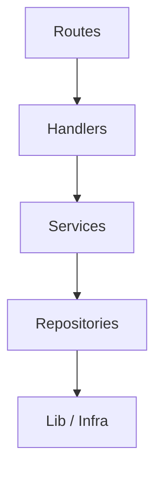
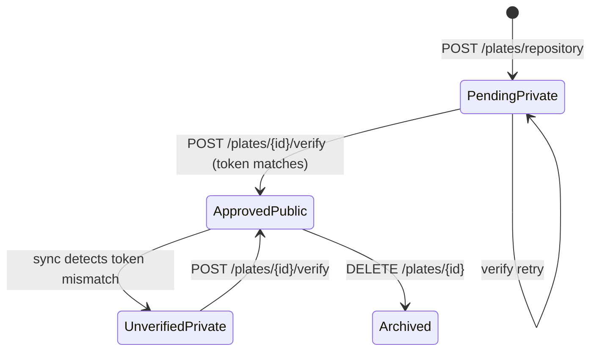
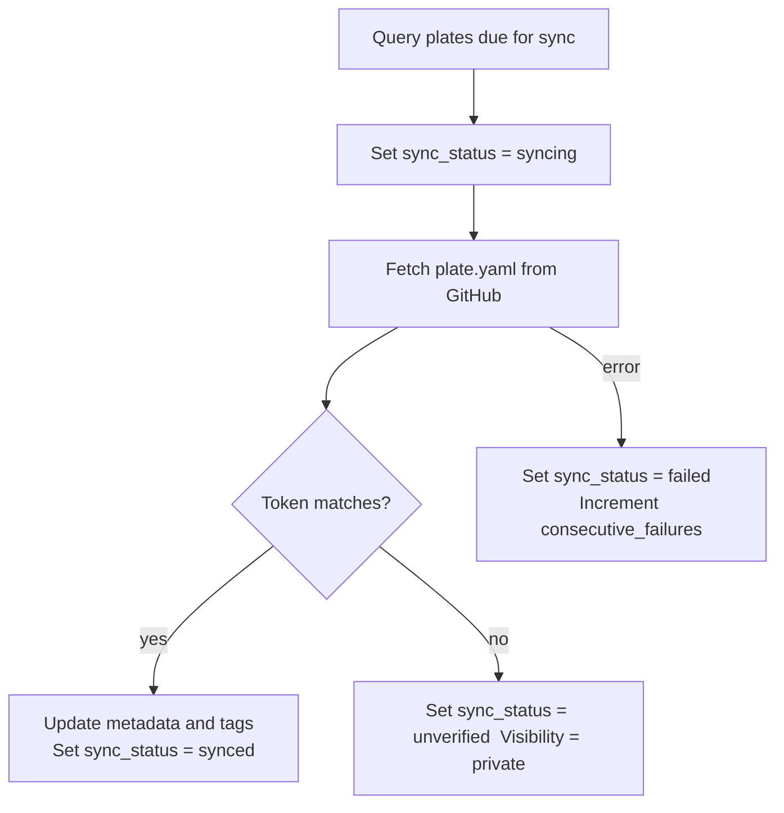
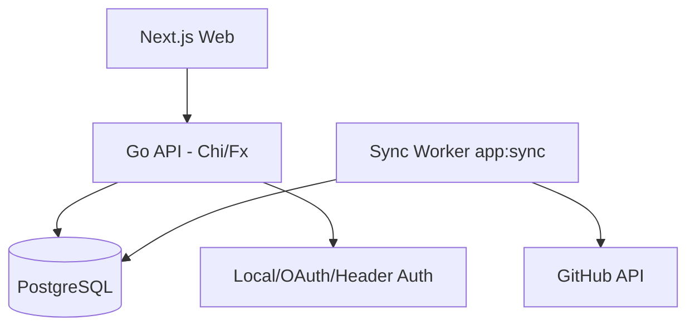
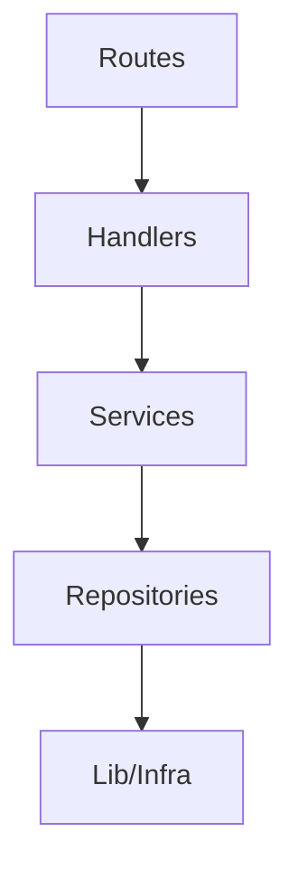
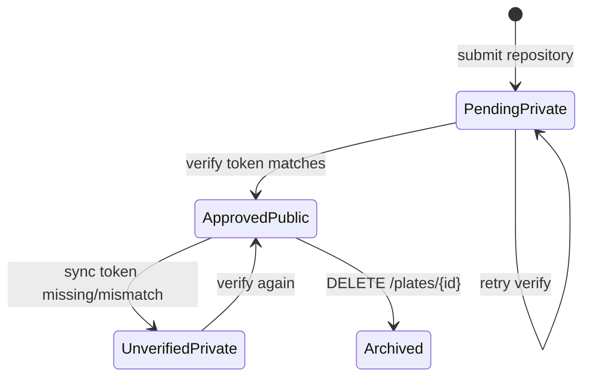
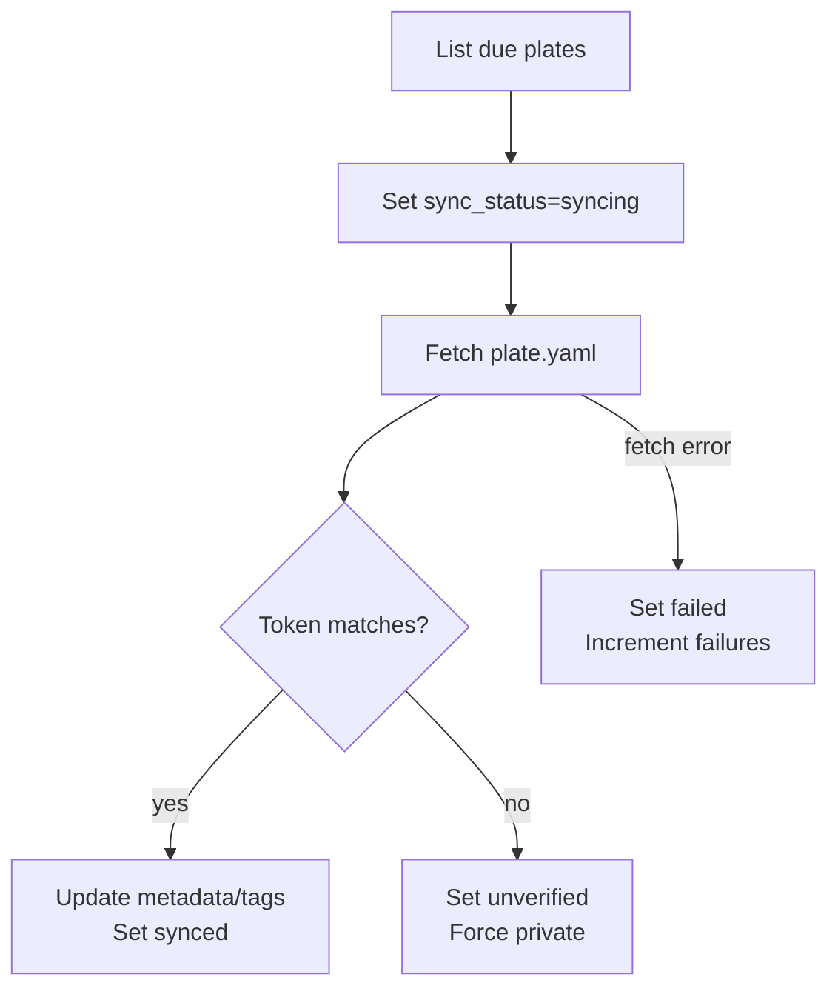

# Architecture

Kikplate is a self-hosted open source marketplace for project templates. It is composed of four runtime processes, all built from a single Go binary in `api/`, plus a Next.js frontend in `web/`.

## Components

| Component | Technology | Role |
|-----------|-----------|------|
| API server | Go, Chi, Uber Fx, GORM | HTTP REST API, auth, plate management |
| Sync worker | Go (same binary) | Background synchronization of repository plates from GitHub |
| Web frontend | Next.js | User interface served at port 3000 |
| Database | PostgreSQL | Single source of truth for all persisted state |

## High-level Runtime Diagram

## Runtime Commands

The Go binary exposes Cobra commands wired through Uber Fx. The same compiled binary is used for all three runtime modes:

| Command | Purpose |
|---------|---------|
| `app:serve` | Start the HTTP API server |
| `app:sync` | Start the background synchronization worker |
| `db:seed` | Seed badge and configuration data into PostgreSQL |

Both `app:serve` and `app:sync` share the same dependency injection container. This means the sync worker has access to the same repositories, services, and configuration as the API server without duplicating infrastructure code.

## Layer Diagram

Dependencies flow strictly downward. No layer may import from the layer above it.

| Layer | Package | Responsibility |
|-------|---------|---------------|
| Routes | `api/handler/routes` | Mount HTTP routes and apply middleware |
| Handlers | `api/handler/handlers` | Parse requests, call services, write responses |
| Services | `api/service` | Business logic and orchestration |
| Repositories | `api/repository/postgres` | Database queries via GORM |
| Lib | `api/lib` | Configuration, logging, DB connection, JWT |

## Dependency Injection

Uber Fx assembles the application. Each layer exposes an Fx module that declares its providers:

| Module | File |
|--------|------|
| Infrastructure | `api/lib/module.go` |
| Repositories | `api/repository/postgres/module.go` |
| Services | `api/service/module.go` |
| Handlers | `api/handler/handlers/module.go` |
| Routes | `api/handler/routes/module.go` |

Adding a new feature means registering a new provider in the relevant module. Fx handles wiring at startup and logs any missing or circular dependencies.

## HTTP Surface

All routes are registered in `api/handler/routes/module.go`. The base URL for all routes is the API server root (default port 3001).

### Health

| Method | Path | Auth |
|--------|------|------|
| GET | `/hello` | Public |

### Auth

| Method | Path | Auth |
|--------|------|------|
| POST | `/auth/register` | Public |
| GET | `/auth/verify-email` | Public |
| POST | `/auth/login` | Public |
| GET | `/auth/providers` | Public |
| GET | `/auth/{provider}/redirect` | Public |
| GET | `/auth/{provider}/callback` | Public |
| GET | `/me` | Required |
| PATCH | `/me/profile` | Required |
| PATCH | `/me/username` | Required |

### Plates

| Method | Path | Auth |
|--------|------|------|
| GET | `/plates` | Public |
| GET | `/plates/stats` | Public |
| GET | `/plates/filters` | Public |
| GET | `/plates/{slug}` | Public |
| GET | `/plates/bookmarked` | Required |
| POST | `/plates/repository` | Required |
| PATCH | `/plates/{id}` | Required |
| DELETE | `/plates/{id}` | Required (archive) |
| DELETE | `/plates/{id}/remove` | Required (hard delete) |
| POST | `/plates/{id}/verify` | Required |
| PUT | `/plates/{id}/organization` | Required |
| POST | `/plates/{id}/bookmark` | Required |
| POST | `/plates/{id}/reviews` | Required |
| PUT | `/plates/{id}/tags` | Required |
| POST | `/plates/{id}/approve` | Required (admin) |
| POST | `/plates/{id}/reject` | Required (admin) |
| POST | `/plates/{id}/badges` | Required (admin) |
| DELETE | `/plates/{id}/badges/{slug}` | Required (admin) |

### Organizations

| Method | Path | Auth |
|--------|------|------|
| GET | `/organizations` | Public |
| GET | `/organizations/by-name/{name}` | Public |
| GET | `/organizations/{id}` | Public |
| POST | `/organizations` | Required |
| GET | `/organizations/me` | Required |
| PUT | `/organizations/{id}` | Required |
| DELETE | `/organizations/{id}` | Required |

### Badges

| Method | Path | Auth |
|--------|------|------|
| GET | `/badges` | Public |

## Plate Lifecycle

A plate is the core entity in Kikplate. Every plate is backed by a public GitHub repository that contains a `plate.yaml` manifest at its root.

Submission flow:

1. User submits a repository URL via `POST /plates/repository`.
2. The service fetches `plate.yaml` from the repository and validates the declared owner.
3. A plate record is created with `status=pending`, `visibility=private`, and a generated `verification_token`.
4. The user adds that token to `plate.yaml` in their repository and calls `POST /plates/{id}/verify`.
5. On success the plate becomes `status=approved`, `visibility=public`, `is_verified=true`.

## Synchronizer

The sync worker runs as `app:sync`. It loops on `sync.poll_interval`, queries plates that are due for synchronization, and processes each plate serially within a configurable batch.

`consecutive_failures` is tracked per plate. After repeated failures, `next_sync_at` is pushed forward using exponential back-off to avoid hammering a repository that is consistently unreachable.

## Auth and Middleware

The middleware chain applied by `app:serve` is, in order:

1. JWT bearer authentication: reads the `Authorization: Bearer <token>` header. On success, sets `account_id` in request context.
2. Optional header-based auth: reads a configurable header (controlled by `AUTH_HEADER`). Allows trusted reverse-proxy authentication without a JWT.

Protected handlers check for `account_id` in context and return `401 Unauthorized` when it is absent.

## Search and Filtering

The plate listing endpoint supports:

| Parameter | Behavior |
|-----------|---------|
| `search` | Full-text search over name, description, and tags using PostgreSQL tsvector with trigram fallback |
| `categories` | Comma-separated or repeated query parameter |
| `tags` | Comma-separated or repeated query parameter |
| `owner_id` | Filter by account UUID |
| `page`, `limit` | Offset pagination |

PostgreSQL GIN indexes are created for full-text search and trigram matching. B-tree indexes cover the common sort and filter paths.

- Backend: Go, Chi, Uber Fx, GORM, PostgreSQL
- Frontend: Next.js
- Auth: local email/password, OAuth providers, or trusted header auth
- Sync: background worker that re-fetches `plate.yaml` from GitHub

## Runtime Commands
The API exposes Cobra commands wired through Fx:

- `app:serve`: start HTTP API server
- `app:sync`: start background sync worker
- `db:seed`: seed data

Sync is configured from `config.yaml` / env with:

- `sync.interval` (default `6h`)
- `sync.poll_interval` (default `30s`)
- `sync.batch_size` (default `25`)

## Layering
Dependencies flow downward:

1. Routes (`api/handler/routes`)
2. Handlers (`api/handler/handlers`)
3. Services (`api/service/*`)
4. Repositories (`api/repository`)
5. Infrastructure (`api/lib`)

Fx modules assemble the app in:

- `api/lib/module.go`
- `api/repository/postgres/module.go`
- `api/service/module.go`
- `api/handler/handlers/module.go`
- `api/handler/routes/module.go`

## HTTP Surface
Current routes are registered by `api/handler/routes/module.go`.

### Health/Test
- `GET /hello`

### Auth
- `POST /auth/register`
- `GET /auth/verify-email?token=...`
- `POST /auth/login`
- `GET /auth/{provider}/redirect`
- `GET /auth/{provider}/callback`
- `GET /auth/providers`
- `GET /me` (auth required)
- `PATCH /me/profile` (auth required)
- `PATCH /me/username` (auth required)

### Plates
- `GET /plates`
- `GET /plates/stats`
- `GET /plates/filters`
- `GET /plates/bookmarked` (auth required)
- `POST /plates/repository` (auth required)
- `GET /plates/{slug}`
- `PATCH /plates/{id}` (auth required)
- `POST /plates/{id}/verify` (auth required)
- `PUT /plates/{id}/organization` (auth required)
- `DELETE /plates/{id}` (archive, auth required)
- `DELETE /plates/{id}/remove` (hard delete, auth required)
- `POST /plates/{id}/bookmark` (auth required)
- `POST /plates/{id}/reviews` (auth required)
- `PUT /plates/{id}/tags` (auth required)
- `POST /plates/{id}/approve` (auth required)
- `POST /plates/{id}/reject` (auth required)
- `POST /plates/{id}/badges` (auth required)
- `DELETE /plates/{id}/badges/{slug}` (auth required)

### Organizations
- `GET /organizations`
- `POST /organizations` (auth required)
- `GET /organizations/me` (auth required)
- `GET /organizations/by-name/{name}`
- `GET /organizations/{id}`
- `PUT /organizations/{id}` (auth required)
- `DELETE /organizations/{id}` (auth required)

### Badges
- `GET /badges`

## Plate Lifecycle
Kickplate is repository-first. Plate type is currently only `repository`.

1. User submits repository via `POST /plates/repository`.
2. Service fetches `plate.yaml` from the submitted repo and branch.
3. Owner validation:
- Personal submission: `plate.yaml.owner` must match username.
- Organization submission: `plate.yaml.owner` must match org name.
4. Plate is created as pending + private with generated `verification_token`.
5. User adds that token to `plate.yaml` and calls `POST /plates/{id}/verify`.
6. On success: plate becomes approved, public, verified, and sync schedule is initialized.

## Synchronizer
`app:sync` loops on `sync.poll_interval` and processes due repository plates.

For each due plate:

1. Mark `sync_status=syncing`.
2. Fetch `plate.yaml` from GitHub API.
3. Validate verification token still matches.
4. If valid, update metadata + tags and mark synced.
5. If invalid/missing token, mark unverified and force private visibility.
6. On failures, increment `consecutive_failures`, save `sync_error`, and schedule next retry.

## Auth and Identity
Middleware chain in `app:serve`:

1. JWT bearer authentication (`Authenticate`)
2. Optional header-based auth (`HeaderAuth`)

Both resolve to an `account_id` in request context. Protected handlers check it explicitly and return `401` when missing.

## Search and Filtering
Plate listing supports:

- Text search (`search`) over weighted full-text + trigram fallback (`name`, `description`, `tags`)
- Multi-category filters (`categories` or `category`)
- Multi-type filters (`types` or `type`)
- Multi-tag filters (`tags` or `tag`)
- Owner filter (`owner_id`)
- Pagination (`page`, `limit`)

Repository adds indexes for full-text, trigram, and common sort/filter paths.
