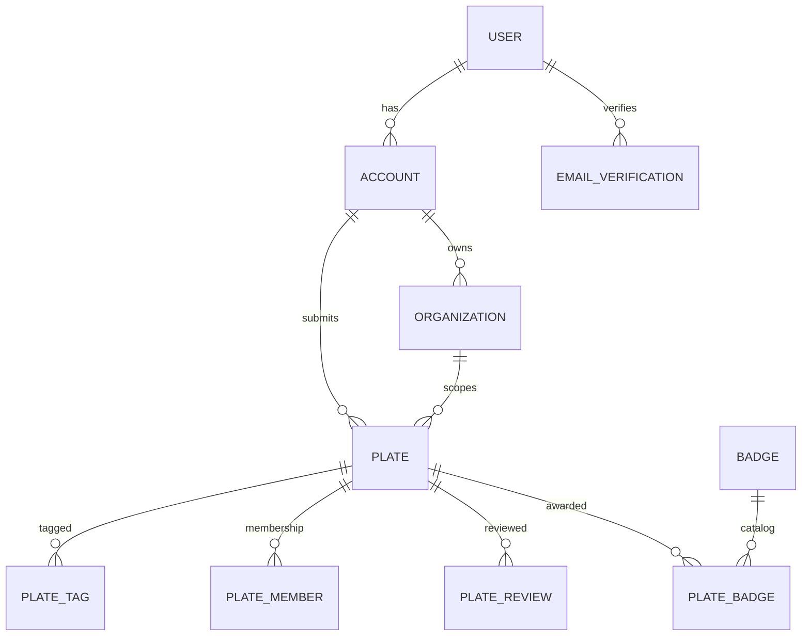
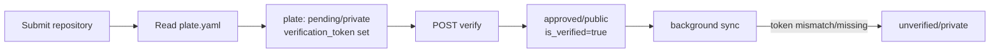
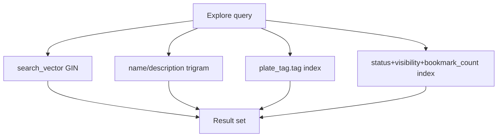

# Database

Kikplate uses PostgreSQL as its only persistence layer. All models live in `api/model` and are managed through GORM. Identity is anchored on `account.id`, and every business entity references an account either directly or indirectly.

The current product model is repository-first: the only supported plate type is `repository`.

## Core Domains

- Identity: `user`, `account`, `email_verification`
- Plates: `plate`, `plate_tag`, `plate_member`, `plate_review`
- Organization: `organization`
- Badges: `badge`, `plate_badge`

## Identity Tables

### `user`
Local auth profile (username/password flow).

- `id` uuid PK
- `username` unique
- `email` unique
- `password_hash`
- `avatar_url` nullable
- `role` (`member`/`admin`)
- `is_active`
- `created_at`, `updated_at`

### `account`
Universal identity for all auth modes (local, OAuth, header).

- `id` uuid PK
- `user_id` nullable FK to `user`
- `provider`
- `provider_user_id`
- `display_name` nullable
- `avatar_url` nullable
- `created_at`

Unique key: `(provider, provider_user_id)`.

### `email_verification`
Email verification tokens for local signups.

- `id` uuid PK
- `user_id` FK to `user`
- `token`
- `is_used`
- `expires_at`
- `created_at`

## Organization Table

### `organization`
Owned namespace for plate submission/ownership.

- `id` uuid PK
- `name` unique
- `description`
- `logo_url` nullable
- `owner_id` FK to `account`
- `created_at`, `updated_at`

Business rule: delete is blocked when organization still owns plates.

## Plate Tables

### `plate`
Primary plate record (repository-based templates).

Key fields:

- Identity/ownership:
- `id` uuid PK
- `owner_id` FK to `account`
- `organization_id` nullable FK to `organization`

- Classification/state:
- `type` (`repository`)
- `slug` unique
- `name`
- `description` nullable
- `category`
- `status` (`pending`, `approved`, `rejected`, `archived`)
- `visibility` (`public`, `private`, `unlisted`)

- Quality and usage:
- `bookmark_count`
- `star_count`
- `avg_rating`
- `is_verified`
- `verified_at` nullable

- Verification token flow:
- `verification_token` nullable, unique/indexed
- `verification_token_set_at` nullable

- Repository sync fields:
- `repo_url` nullable
- `branch` nullable
- `sync_status` nullable (`pending`, `syncing`, `synced`, `failed`, `unverified`)
- `sync_error` nullable
- `sync_interval` nullable
- `next_sync_at` nullable
- `last_synced_at` nullable
- `consecutive_failures`

- Metadata:
- `metadata` jsonb (parsed `plate.yaml`)

- Timestamps:
- `published_at` nullable
- `created_at`, `updated_at`

Notes:

- Legacy file-plate fields (`content`, `filename`) were removed.
- Sync worker can force unverified plates back to private visibility.

### `plate_tag`
Normalized tags for filter/search.

- `id` uuid PK
- `plate_id` FK to `plate`
- `tag`

Unique per plate/tag.

### `plate_member`
Membership relation for ownership and bookmark tracking.

- `id` uuid PK
- `plate_id` FK to `plate`
- `account_id` FK to `account`
- `role` (`owner`, `member`)
- `is_bookmarked`
- `bookmarked_at` nullable
- `joined_at`

Unique `(plate_id, account_id)`.

### `plate_review`
Ratings/reviews per account and plate.

- `id` uuid PK
- `plate_id` FK to `plate`
- `account_id` FK to `account`
- `rating` (1..5)
- `title` nullable
- `body` nullable
- `is_verified_use`
- `created_at`, `updated_at`

Unique `(plate_id, account_id)` prevents duplicate reviews.

## Badge Tables

### `badge`
Badge catalog.

- `id` uuid PK
- `slug` unique
- `name`
- `description`
- `icon`
- `tier`
- `created_at`

### `plate_badge`
Many-to-many links between plates and badges.

- `id` uuid PK
- `plate_id` FK to `plate`
- `badge_id` FK to `badge`
- `granted_by`
- `reason` nullable
- `granted_at`

Unique `(plate_id, badge_id)`.

## Search and Performance Indexing
`lib/db.go` applies extended indexes/migrations for discovery performance:

- weighted generated tsvector on `plate` (`name`, `description`, `category`)
- GIN full-text index on `search_vector`
- trigram indexes on `plate.name` and `plate.description`
- composite sort/filter index on `(status, visibility, bookmark_count DESC)`
- index on `plate_tag.tag`

`pg_trgm` extension is created when available.

## Consistency Notes

- `avg_rating` is denormalized and recomputed on review writes.
- `user_rating` in API responses is transient (not persisted on `plate`).
- Organization ownership checks are enforced in service layer before plate reassignment.
