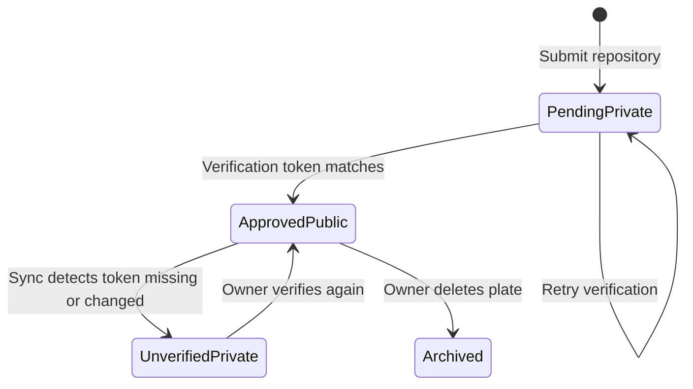

# How It Works

This document explains the core concepts of Kikplate and walks through the full lifecycle of a plate from submission to discovery.

## Core Concepts

### Plate

A plate is a project template backed by a public GitHub repository. It is the central entity in Kikplate. When a developer finds a plate they like, they can scaffold a new project from it in seconds using the CLI.

Every plate must have a `plate.yaml` manifest at the root of its repository. That file is the contract between the repository author and the Kikplate platform.

### plate.yaml

The manifest describes the plate to the platform. A minimal example:

```yaml
name: Go Chi REST API
description: A production-ready REST API starter using Go and Chi.
category: backend
owner: myusername
tags:
  - golang
  - rest
  - chi
```

When a plate is under review or already published, you must also include the `verification_token` that Kikplate issues during submission:

```yaml
name: Go Chi REST API
description: A production-ready REST API starter using Go and Chi.
category: backend
owner: myusername
verification_token: kp_verif_xxxxxxxxxxxxxxxx
tags:
  - golang
  - rest
  - chi
```

#### Manifest fields

| Field | Required | Notes |
|-------|----------|--------|
| `name` | Yes | Becomes the plate display name and basis for the public slug. Must be unique across the platform when combined with the owner namespace. |
| `owner` | Yes | Must match the submitting user’s **username** or the selected **organization name**. |
| `description` | No | Free text shown on the plate page. |
| `category` | No | Must be one of the **slugs** defined under `plate_categories` in the server `config.yaml` (match is case-insensitive). If omitted or not recognized, the platform stores the template under the **other** category—submission does not fail. See [Configuration](configuration.md#plate_categories). |
| `tags` | No | A list of short labels used for search and filters. |
| `verification_token` | After submit | Omitted on first submit. After Kikplate issues a token, add it to the file and run verify so the plate can go public. |

### Badge

Badges are quality signals awarded to plates. They are defined in `config/config.yaml` under the `badges` key and seeded into the database. There are two tiers:

| Tier | Description |
|------|-------------|
| `official` | Awarded only by Kikplate administrators |
| `community` | Can be requested by any user through the badge request process |

### Organization

Organizations are named namespaces that group plates under a shared identity. A user creates an organization, and other users can submit plates under that organization's name. The `plate.yaml` owner field must match the organization name for organization-scoped plates.

## Plate Lifecycle

### Step 1: Submission

A user submits a GitHub repository via:

```
POST /plates/repository
{
  "repo_url": "https://github.com/myorg/my-template",
  "branch": "main"
}
```

Or using the CLI:

```
kikplate submit https://github.com/myorg/my-template
```

When a plate is submitted, Kikplate:

1. Fetches `plate.yaml` from the specified repository and branch.
2. Validates that the `owner` field matches the authenticated user's username (or organization name if submitted under an organization).
3. Creates a plate record with `status=pending` and `visibility=private`.
4. Generates a `verification_token` and stores it on the plate.

The verification token is returned in the submission response and printed by the CLI.

### Step 2: Verification

The owner adds the `verification_token` to their `plate.yaml`, commits it, and then calls:

```
POST /plates/{id}/verify
```

Or using the CLI:

```
kikplate verify myorg/my-template
```

Kikplate re-fetches `plate.yaml` and checks that the token in the file matches the one stored in the database. If they match, the plate transitions to `status=approved`, `visibility=public`, `is_verified=true`.

The plate is now publicly discoverable and searchable.

### Step 3: Ongoing Synchronization

After a plate is approved, the sync worker monitors the repository on a schedule. The sync interval is configured per-deployment (default: 20 minutes for the poll loop, configurable `sync.interval` per plate).

For each due plate, the sync worker:

1. Fetches `plate.yaml` from GitHub.
2. Validates the verification token is still present and correct.
3. If valid: updates the plate metadata and tags, sets `sync_status=synced`, and schedules the next sync.
4. If the token is missing or wrong: sets `sync_status=unverified` and forces `visibility=private`. The plate is effectively taken offline until the owner verifies again.
5. If the fetch fails: increments `consecutive_failures`, records the error, and schedules a retry with back-off.

### State Machine



## Discovery and Search

Published plates are publicly discoverable without authentication. The API supports:

| Feature | Description |
|---------|-------------|
| Full-text search | PostgreSQL tsvector using weighted columns: name (A), description (B), tags (C) |
| Trigram fallback | pg_trgm index for substring and fuzzy matching |
| Category filter | Filter by a single or multiple categories |
| Tag filter | Filter by one or more tags |
| Pagination | Page and limit query parameters |

Filters and available categories can be discovered from `GET /plates/filters` before building a search interface.

## Authentication Modes

Kikplate supports three authentication modes that can coexist in a single deployment:

| Mode | Description |
|------|-------------|
| Local | Email and password. Users register, verify their email, and receive a JWT. |
| OAuth | GitHub, Google, or GitLab. Configured in `config.yaml` under `sso.providers`. |
| Header | Trusted header passed by a reverse proxy. Configured via `AUTH_HEADER` environment variable. Useful for corporate SSO or Kubernetes service account auth. |

All three modes resolve to an `account` record on the first login, which becomes the universal identity anchor for all operations.

## Scaffolding a Project

Once you have found a plate you want to use, scaffold a new project from it:

```
kikplate plates add myorg/my-template
kikplate scaffold myorg/my-template my-new-project
```

The CLI:

1. Looks up the plate in your local list or queries the server.
2. Clones the repository into `my-new-project/`.
3. Strips the `plate.yaml` manifest (it is the template author's file, not yours).
4. Creates a `.kikplate.origin` file recording where the project came from.
5. Optionally stamps the README with a "Scaffolded from" footer.

You can also scaffold directly to a remote Git repository:

```
kikplate scaffold myorg/my-template https://github.com/you/new-repo.git
```

This creates a clean initial commit and pushes to the remote.

## Generating a Project

Generation is schema driven. Instead of cloning a repository as is, Kikplate resolves a plate schema, validates input values, renders templates, and returns a zip archive.

### Endpoints

```
GET /generate/{slug}/schema
POST /generate/{slug}
```

`GET /generate/{slug}/schema` returns the generation contract for a plate.

`POST /generate/{slug}` accepts:

```json
{
  "values": {
    "projectName": "my-app",
    "modulePath": "github.com/you/my-app",
    "modules.docker.enabled": true
  }
}
```

The response body is `application/zip` and includes `X-Generation-ID` in headers.

### Value Handling

Schema defaults are applied automatically.

Required fields are enforced before rendering.

Types are validated and coerced for common scalar types.

Supported scalar types include `string`, `bool`, `int`, `number`, and `enum`.

### Conditional Files

Each file entry in `plate.yaml` can include `condition`.

Conditions support dotted lookups and boolean expressions with `!`, `&&`, `||`, `==`, and `!=`.

Examples:

```yaml
condition: modules.docker.enabled
condition: database == postgres
condition: modules.auth.enabled && database != none
```

### Template Helpers

Templates can use helper functions:

`lower`

`upper`

`trim`

`replace`

`default`

`slugify`

Example:

```gotemplate
module {{ .modulePath | default "github.com/acme/app" }}
image: {{ slugify .projectName }}
```

### Output Safety

Rendered file paths are normalized before archiving.

Absolute paths and parent directory traversal are rejected.

This prevents unsafe output entries inside generated archives.
